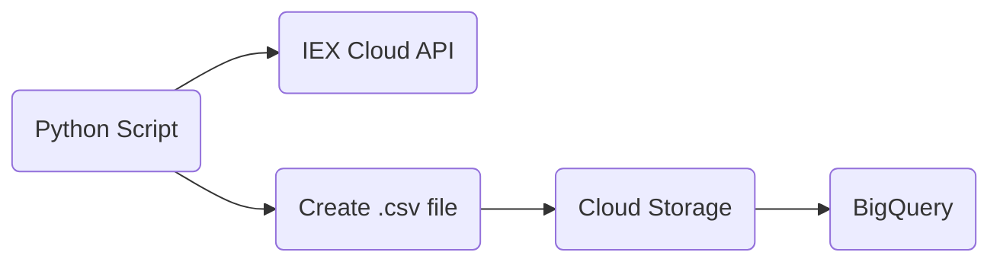

# Data Pipeline with Google Cloud

> This is my first project and attempt at creating a data pipeline. I created this so that I can start getting some experience in data engineering.

## Background Information

This data pipeline can be broken down in the following steps:

1. A Python script calls out to a stock API to retreive data about the 500 companies in the S&P 500 **and** creates a `.csv` file. The data currently consists of: the ticker symbol, company name, current price, and change in price.
2. Using a virtual machine with Compute Engine, the Python script is ran once a day with updated data.
3. The created `.csv` file is then placed into Cloud Storage.
4. Using BigQuery, the `.csv` file is uploaded as a table with data where SQL queries can be ran. 

## Tools used

* [IEX Cloud](https://www.iexcloud.io) for financial data.
* Google Cloud services:
    * [Compute Engine](https://cloud.google.com/compute)
    * [Cloud Storage](https://cloud.google.com/storage)
    * [BigQuery](https://cloud.google.com/bigquery/)
