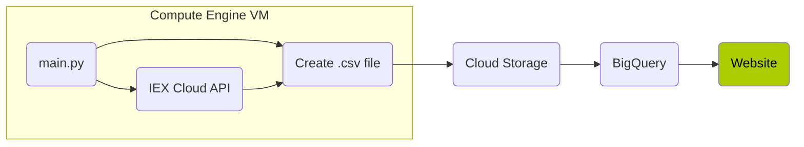

# Data Pipeline with Python and Google Cloud

> This is my first project and attempt at creating a data pipeline. It's a very simple example, but it helps to understand how data can flow from one place to another. In this case, an API through cloud services then to my website.

> I created this to start getting experience with data engineering and using cloud tools.

## How the Pipeline Works

This data pipeline can be broken down in the following steps:

1. Within a Compute Engine virtual machine, `main.py` runs and does the following:
    1. Reaches out to IEX Cloud API.
    2. Creates a `.csv` file with new stock data.
    3. Copies the `.csv` file to Cloud Storage.
    4. Uploads the `.csv` file to BigQuery.
    5. A CRON job that is configured in the virtual machine runs `main.py` every 15 minutes, 9:00 - 16:00 EST, Monday through Friday.
2. Using the [BigQuery API](https://cloud.google.com/bigquery/docs/quickstarts/quickstart-client-libraries), the data is queried and then displayed on my [website](https://digitalghost.dev/projects/data-pipeline).
    * *Note:* The file that connects to BigQuery to run the SQL query is located in my [Flask application folder](https://github.com/digitalghost-dev/website) for my website in the `bq_conn.py` file.

## Services used

* [IEX Cloud](https://www.iexcloud.io) for financial data.
* Google Cloud services:
    * [Compute Engine](https://cloud.google.com/compute)
    * [Cloud Storage](https://cloud.google.com/storage)
    * [BigQuery](https://cloud.google.com/bigquery/)